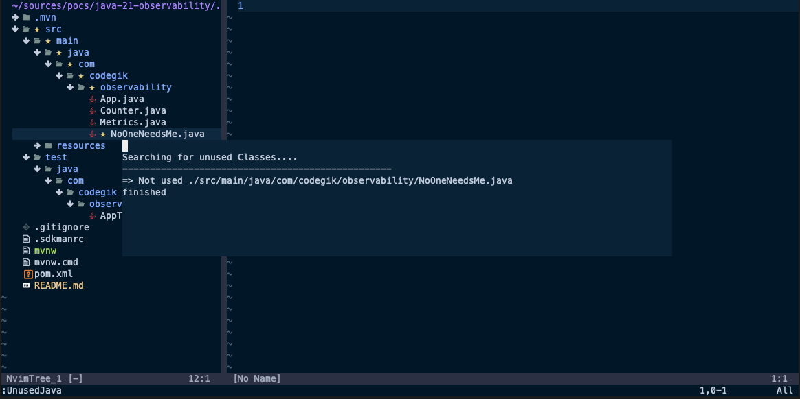

# nvim-unused

Find unused java classes. This plugin will search in current directory looking for classes that are not being used by others.



## Setup by plugin managers

### [packer](https://github.com/wbthomason/packer.nvim)

```
use("codegik/nvim-unused")
```

### [vim-plug](https://github.com/junegunn/vim-plug)

```
Plug 'codegik/nvim-unused'
```

## Autoload

Enable autoload plugin by adding the following code in `~/.config/nvim/init.lua`.

```
require("nvim-unused")
```

## Usage

1. Open Neovim
2. Execute `:UnusedJava`
